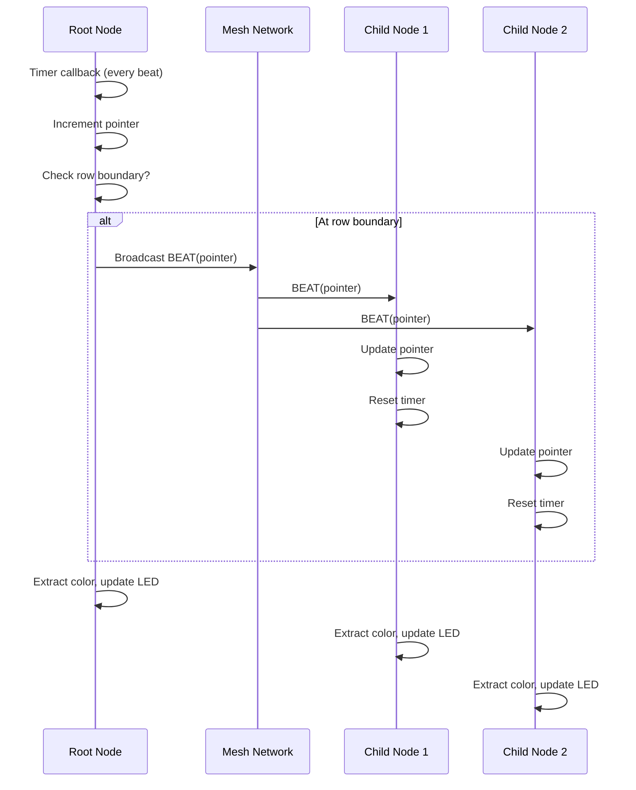
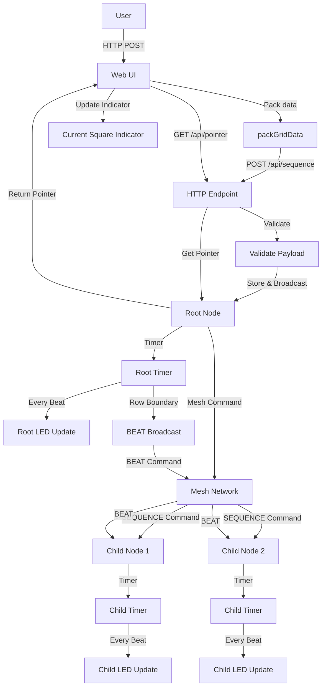

# Sequence Mode Developer Guide

**Last Updated:** 2025-01-15

## Table of Contents

1. [Overview](#overview)
2. [Architecture](#architecture)
3. [Data Formats](#data-formats)
4. [Algorithms](#algorithms)
5. [API Reference](#api-reference)
6. [Integration Points](#integration-points)
7. [State Management](#state-management)
8. [Synchronization](#synchronization)

## Overview

### Purpose

Sequence mode enables synchronized playback of color sequences across all nodes in an ESP-MESH network. The system allows users to create patterns using a 16x16 grid (up to 256 squares), set playback tempo, and synchronize sequences to all connected nodes with automatic drift correction.

> **For Users**: See [User Guide](../user-guides/mode-sequence.md) for usage instructions and examples.

### Design Decisions

**Variable-length sequences**: Sequences can be 1-16 rows (16-256 squares) to allow efficient use of memory and network bandwidth for shorter patterns.

**4-bit color quantization**: Colors are stored as 4-bit values (16 levels per channel) instead of 8-bit to reduce memory usage from 768 bytes to 384 bytes for a full 256-square sequence.

**Packed color format**: Two squares are packed into 3 bytes, reducing storage requirements by 50% compared to storing RGB values separately.

**BEAT synchronization**: Root node sends BEAT messages at row boundaries to correct timer drift while allowing nodes to play independently if BEAT messages are lost.

**Module separation**: Root and child node functionality is separated into different modules (`mode_sequence_root.c` and `mode_sequence_node.c`) for clear separation of concerns.

## Architecture

### File Structure

The sequence mode implementation consists of three main files:

- **`src/mode_sequence_root.c`**: Root node implementation
  - HTTP endpoint integration
  - Sequence storage and broadcasting
  - Playback timer management
  - BEAT message generation

- **`src/mode_sequence_node.c`**: Child node implementation
  - Mesh command reception and processing
  - Playback timer management
  - BEAT message handling

- **`include/node_sequence.h`**: Shared API definitions
  - Function declarations
  - Helper functions for size calculations
  - Constants and data structures

### Module Responsibilities

**Root Node** (`mode_sequence_root.c`):
- Receives sequence data via HTTP POST `/api/sequence`
- Stores sequence data locally
- Broadcasts sequence to all child nodes via mesh network
- Manages root node playback timer
- Generates and broadcasts BEAT messages at row boundaries
- Provides pointer query endpoint (`GET /api/sequence/pointer`)
- Internal function `mode_sequence_root_broadcast_control()` used by start/stop/reset functions

**Child Node** (`mode_sequence_node.c`):
- Receives sequence commands from mesh network
- Stores sequence data locally
- Manages child node playback timer
- Handles control commands (START/STOP/RESET/BEAT)
- Processes BEAT messages for drift correction

**Shared Functionality**:
- Color extraction algorithm (same in both modules)
- Size calculation helpers (in header file)
- Data format definitions

### Separation of Concerns

- **Root-specific**: HTTP handling, mesh broadcasting, BEAT generation
- **Node-specific**: Mesh command reception, BEAT processing
- **Shared**: Color extraction, data format handling, size calculations

## Data Formats

### Packed Color Array Format

Colors are stored in a packed format where **2 squares = 3 bytes**:

**Byte Layout**:
- **Byte 0**: Even square R (upper nibble), Even square G (lower nibble)
- **Byte 1**: Even square B (upper nibble), Odd square R (lower nibble)
- **Byte 2**: Odd square G (upper nibble), Odd square B (lower nibble)

**Example** (squares 0 and 1):
- Square 0: R=12 (0xC), G=5 (0x5), B=10 (0xA)
- Square 1: R=3 (0x3), G=15 (0xF), B=7 (0x7)

Packed as:
- Byte 0: `0xC5` (R=0xC in upper nibble, G=0x5 in lower nibble)
- Byte 1: `0xA3` (B=0xA in upper nibble, R=0x3 in lower nibble)
- Byte 2: `0xF7` (G=0xF in upper nibble, B=0x7 in lower nibble)

**Size Calculation**:
- Maximum size: 384 bytes (256 squares)
- Variable size: `num_rows * 24` bytes
- Formula: `(num_rows * 16 / 2) * 3 = num_rows * 24`

### Command Packet Formats

**SEQUENCE Command** (variable length):
```
Byte 0: MESH_CMD_SEQUENCE (0x04)
Byte 1: rhythm (1-255, in 10ms units)
Byte 2: num_rows (1-16, number of rows)
Bytes 3-N: color_data (variable length, num_rows * 24 bytes)
```

Total size: `3 + (num_rows * 24)` bytes

**START Command** (1 byte):
```
Byte 0: MESH_CMD_SEQUENCE_START (0x05)
```

**STOP Command** (1 byte):
```
Byte 0: MESH_CMD_SEQUENCE_STOP (0x06)
```

**RESET Command** (1 byte):
```
Byte 0: MESH_CMD_SEQUENCE_RESET (0x07)
```

**BEAT Command** (2 bytes):
```
Byte 0: MESH_CMD_SEQUENCE_BEAT (0x08)
Byte 1: pointer (0-255, current position)
```

### HTTP Payload Format

**POST /api/sequence** (variable length):
```
Byte 0: rhythm (1-255, in 10ms units)
Byte 1: num_rows (1-16, number of rows)
Bytes 2-N: color_data (variable length, num_rows * 24 bytes)
```

Total size: `2 + (num_rows * 24)` bytes

**GET /api/sequence/pointer**:
- Response: Plain text number (0-255)
- Example: `"42"` (pointer at position 42)

### Rhythm Value Encoding

Rhythm values are encoded in **10ms units**:

- **Frontend tempo (ms) → Backend rhythm**: `Math.floor(tempo / 10)`
- **Backend rhythm → Actual interval**: `rhythm * 10ms` (in microseconds: `rhythm * 10000`)

**Examples**:
- Tempo 250ms → Rhythm 25 → Interval 250ms
- Tempo 100ms → Rhythm 10 → Interval 100ms
- Tempo 2550ms → Rhythm 255 → Interval 2550ms

**Validation**:
- Minimum rhythm: 1 (10ms)
- Maximum rhythm: 255 (2550ms)
- Invalid: 0 (rejected)

### Variable-Length Handling

Size calculation functions (in `node_sequence.h`):

```c
static inline uint16_t sequence_color_data_size(uint8_t num_rows) {
    return (uint16_t)((num_rows * 16 / 2) * 3);  // num_rows * 24
}

static inline uint16_t sequence_payload_size(uint8_t num_rows) {
    return 2 + sequence_color_data_size(num_rows);  // HTTP payload
}

static inline uint16_t sequence_mesh_cmd_size(uint8_t num_rows) {
    return 3 + sequence_color_data_size(num_rows);  // Mesh command
}
```

**Validation**:
- HTTP endpoint validates `num_rows` before calculating expected size
- Mesh command handler validates size matches expected value
- Both reject if `num_rows < 1 || num_rows > 16`

## Algorithms

### Color Extraction Algorithm

**Input**: Packed color array, square index (0-255)

**Output**: RGB values (4-bit, 0-15 each)

**Steps**:

1. **Validate inputs**: Check pointers are not NULL
2. **Validate square index**: 
   - Child node: `square_index < (sequence_length * 16)` (correct)
   - Root node: `square_index >= 256` (hardcoded, should use `sequence_length * 16`)
3. **Calculate pair index**: `pair_index = square_index / 2`
4. **Calculate byte offset**: `byte_offset = pair_index * 3`
5. **Extract based on even/odd**:
   - **Even square** (`square_index % 2 == 0`):
     - R = `(packed_data[byte_offset] >> 4) & 0x0F`
     - G = `packed_data[byte_offset] & 0x0F`
     - B = `(packed_data[byte_offset + 1] >> 4) & 0x0F`
   - **Odd square** (`square_index % 2 == 1`):
     - R = `packed_data[byte_offset + 1] & 0x0F`
     - G = `(packed_data[byte_offset + 2] >> 4) & 0x0F`
     - B = `packed_data[byte_offset + 2] & 0x0F`

**Implementation**: See `extract_square_rgb()` in both `mode_sequence_root.c` and `mode_sequence_node.c`

**Note**: Root node implementation has a hardcoded 256 check instead of using `sequence_length * 16` like the child node. This should be fixed to support variable-length sequences correctly.

### Color Scaling Algorithm

**Input**: 4-bit RGB values (0-15)

**Output**: 8-bit RGB values (0-255)

**Algorithm**: `8bit_value = 4bit_value * 16`

**Rationale**: 
- 4-bit range: 0-15 (16 levels)
- 8-bit range: 0-255 (256 levels)
- Scaling factor: 255/15 = 17, but using 16 for simplicity
- Result: 0→0, 15→240 (not 255, but close enough for LED display)

**Implementation**: See timer callbacks in both modules:
```c
r_scaled = r_4bit * 16;
g_scaled = g_4bit * 16;
b_scaled = b_4bit * 16;
```

### Pointer Wrapping Logic

**Pointer Range**: 0 to `(sequence_length * 16) - 1`

**Increment and Wrap**:
```c
uint16_t max_squares = sequence_length * 16;
sequence_pointer = (sequence_pointer + 1) % max_squares;
```

**Examples**:
- 4 rows: max_squares = 64, pointer wraps at 64 (0-63)
- 16 rows: max_squares = 256, pointer wraps at 256 (0-255)

**Row Boundary Detection**:
```c
if ((sequence_pointer % 16) == 0 && sequence_pointer < max_squares) {
    // At row boundary, send BEAT
}
```

**Edge Cases**:
- Pointer 0: Start of sequence, row boundary
- Pointer at max_squares: Wraps to 0
- Pointer validation: Check `pointer < max_squares` before BEAT send

### BEAT Synchronization Algorithm

**When BEAT is Sent**:
- Root node timer callback detects row boundary
- Condition: `(sequence_pointer % 16) == 0 && sequence_pointer < max_squares`
- BEAT contains current pointer value

**BEAT Message Processing (Child Node)**:

1. **Validate sequence is active**: Ignore if not active
2. **Validate pointer**: Check `received_pointer < max_squares`
3. **Update pointer**: `sequence_pointer = received_pointer`
4. **Reset timer**: Stop, delete, and recreate timer with same rhythm
5. **Resume playback**: Timer continues from new pointer position

**Drift Correction**:
- **Why drift occurs**: Timer inaccuracies accumulate over time
- **How BEAT corrects**: Pointer update + timer reset synchronizes all nodes
- **Frequency**: Once per row (every 16 squares)
- **Effect**: Prevents long-term drift while allowing smooth playback

**Independent Playback**:
- Child nodes continue playing if BEAT messages are lost
- Timer runs independently with local rhythm value
- Resynchronization occurs on next received BEAT message
- No error if BEAT is lost (graceful degradation)

## API Reference

### Root Node Functions

#### `mode_sequence_root_store_and_broadcast()`

**Signature**:
```c
esp_err_t mode_sequence_root_store_and_broadcast(uint8_t rhythm, uint8_t num_rows, 
                                                  uint8_t *color_data, uint16_t color_data_len);
```

**Parameters**:
- `rhythm`: Rhythm value in 10ms units (1-255)
- `num_rows`: Number of rows in sequence (1-16)
- `color_data`: Pointer to packed color array
- `color_data_len`: Length of color_data in bytes

**Returns**: `ESP_OK` on success, error code on failure

**Behavior**:
- Validates inputs (rhythm, num_rows, color_data pointer)
- Stores sequence data locally
- Stops existing timer if running
- Resets pointer to 0
- Starts root node playback timer
- Broadcasts sequence to all child nodes via mesh network
- Returns success even if no child nodes exist

**Error Codes**:
- `ESP_ERR_INVALID_STATE`: Not root node
- `ESP_ERR_INVALID_ARG`: Invalid rhythm (0), num_rows (<1 or >16), or NULL color_data

#### `mode_sequence_root_start()`

**Signature**:
```c
esp_err_t mode_sequence_root_start(void);
```

**Returns**: `ESP_OK` on success, error code on failure

**Behavior**:
- Stops existing timer if running
- Resets pointer to 0
- Starts playback timer
- Broadcasts START command to all child nodes

**Error Codes**:
- `ESP_ERR_INVALID_STATE`: Not root node or no sequence data
- Timer creation/start errors

#### `mode_sequence_root_stop()`

**Signature**:
```c
esp_err_t mode_sequence_root_stop(void);
```

**Returns**: `ESP_OK` on success

**Behavior**:
- Stops and deletes playback timer
- Broadcasts STOP command to all child nodes

**Error Codes**:
- `ESP_ERR_INVALID_STATE`: Not root node

#### `mode_sequence_root_reset()`

**Signature**:
```c
esp_err_t mode_sequence_root_reset(void);
```

**Returns**: `ESP_OK` on success, error code on failure

**Behavior**:
- Resets pointer to 0
- If sequence is active, restarts timer from beginning
- Broadcasts RESET command to all child nodes

**Error Codes**:
- `ESP_ERR_INVALID_STATE`: Not root node

#### `mode_sequence_root_broadcast_beat()`

**Signature**:
```c
esp_err_t mode_sequence_root_broadcast_beat(void);
```

**Returns**: `ESP_OK` on success, error code on failure

**Behavior**:
- Validates pointer is within range
- Broadcasts BEAT command with current pointer value to all child nodes
- Called automatically by timer callback at row boundaries

**Error Codes**:
- `ESP_ERR_INVALID_STATE`: Not root node

#### `mode_sequence_root_get_pointer()`

**Signature**:
```c
uint16_t mode_sequence_root_get_pointer(void);
```

**Returns**: Current sequence pointer value (0-255)

**Behavior**:
- Returns current pointer position
- Used by HTTP endpoint for web UI indicator

#### `mode_sequence_root_is_active()`

**Signature**:
```c
bool mode_sequence_root_is_active(void);
```

**Returns**: `true` if sequence is active, `false` otherwise

**Behavior**:
- Returns current playback state
- Used to check if heartbeat should be disabled

### Child Node Functions

#### `mode_sequence_node_handle_command()`

**Signature**:
```c
esp_err_t mode_sequence_node_handle_command(uint8_t cmd, uint8_t *data, uint16_t len);
```

**Parameters**:
- `cmd`: Command byte (should be `MESH_CMD_SEQUENCE`)
- `data`: Pointer to command data (variable length)
- `len`: Length of data

**Returns**: `ESP_OK` on success, `ESP_FAIL` on validation failure

**Behavior**:
- Validates command format and size
- Extracts rhythm, num_rows, and color_data
- Stops existing timer if running
- Stores sequence data locally
- Resets pointer to 0
- Starts playback timer

**Error Codes**:
- `ESP_FAIL`: Validation failure (invalid cmd, size, rhythm, or num_rows)
- Timer creation/start errors

#### `mode_sequence_node_stop()`

**Signature**:
```c
void mode_sequence_node_stop(void);
```

**Behavior**:
- Stops and deletes playback timer
- Clears active state
- Called externally (e.g., when RGB command is received)

#### `mode_sequence_node_handle_control()`

**Signature**:
```c
esp_err_t mode_sequence_node_handle_control(uint8_t cmd, uint8_t *data, uint16_t len);
```

**Parameters**:
- `cmd`: Command byte (START/STOP/RESET/BEAT)
- `data`: Pointer to command data
- `len`: Length of data (1 for START/STOP/RESET, 2 for BEAT)

**Returns**: `ESP_OK` on success, error code on failure

**Behavior**:
- Routes to appropriate handler based on command
- Validates command and data size
- Processes control command

**Error Codes**:
- `ESP_ERR_INVALID_ARG`: Invalid command or data size

#### `mode_sequence_node_start()`

**Signature**:
```c
esp_err_t mode_sequence_node_start(void);
```

**Returns**: `ESP_OK` on success, error code on failure

**Behavior**:
- Stops existing timer if running
- Resets pointer to 0
- Starts playback timer

**Error Codes**:
- `ESP_ERR_INVALID_STATE`: No sequence data available
- Timer creation/start errors

#### `mode_sequence_node_reset()`

**Signature**:
```c
esp_err_t mode_sequence_node_reset(void);
```

**Returns**: `ESP_OK` on success, error code on failure

**Behavior**:
- Resets pointer to 0
- If sequence is active, restarts timer from beginning

**Error Codes**:
- Timer restart errors

#### `mode_sequence_node_handle_beat()`

**Signature**:
```c
esp_err_t mode_sequence_node_handle_beat(uint16_t received_pointer);
```

**Parameters**:
- `received_pointer`: Pointer position from BEAT message (0-255)

**Returns**: `ESP_OK` on success, error code on failure (ignored if sequence not active)

**Behavior**:
- Validates sequence is active (ignores if not active)
- Validates pointer is within range
- Updates local pointer to received value
- Resets timer to resynchronize

**Error Codes**:
- `ESP_OK`: Sequence not active (not an error, just ignored)
- `ESP_ERR_INVALID_ARG`: Invalid pointer value

#### `mode_sequence_node_is_active()`

**Signature**:
```c
bool mode_sequence_node_is_active(void);
```

**Returns**: `true` if sequence is active, `false` otherwise

**Behavior**:
- Returns current playback state
- Used to check if heartbeat should be disabled

### Helper Functions

#### `sequence_color_data_size()`

**Signature**:
```c
static inline uint16_t sequence_color_data_size(uint8_t num_rows);
```

**Returns**: Size of color data in bytes for given number of rows

**Formula**: `(num_rows * 16 / 2) * 3 = num_rows * 24`

#### `sequence_payload_size()`

**Signature**:
```c
static inline uint16_t sequence_payload_size(uint8_t num_rows);
```

**Returns**: Size of HTTP payload in bytes

**Formula**: `2 + sequence_color_data_size(num_rows)`

#### `sequence_mesh_cmd_size()`

**Signature**:
```c
static inline uint16_t sequence_mesh_cmd_size(uint8_t num_rows);
```

**Returns**: Size of mesh command in bytes

**Formula**: `3 + sequence_color_data_size(num_rows)`

## Integration Points

### HTTP Endpoint Integration

**File**: `src/mesh_web.c`

**POST /api/sequence** (`api_sequence_post_handler`):

1. **Reads payload** in two stages:
   - First 2 bytes: rhythm + num_rows
   - Remaining bytes: color_data (variable length)

2. **Validates**:
   - `num_rows` in range 1-16
   - `rhythm` in range 1-255
   - Payload size matches expected size
   - Color data length matches expected size

3. **Calls**: `mode_sequence_root_store_and_broadcast(rhythm, num_rows, color_data, color_data_len)`

4. **Returns**: JSON response `{"success": true}` or error message

**GET /api/sequence/pointer** (`api_sequence_pointer_handler`):

1. **Calls**: `mode_sequence_root_get_pointer()`
2. **Returns**: Plain text pointer value (0-255)
3. **Used by**: Web UI current square indicator

**Registration**: Endpoints registered in `mesh_web_start()` function

**Web UI Current Square Indicator**:

The web UI includes a visual indicator that shows which square is currently playing:

- **Function**: `updateSequenceIndicator()` - Fetches pointer from backend and updates border
- **Function**: `startSequenceIndicator()` - Starts periodic updates every `tempo * 16` ms
- **Function**: `stopSequenceIndicator()` - Stops updates and removes border
- **Update interval**: `tempo * 16` milliseconds (once per row)
- **Implementation**: Uses `setInterval()` to periodically call `updateSequenceIndicator()`
- **Border class**: `.grid-square.current` CSS class applied to current square
- **Pointer calculation**: `row = Math.floor(pointer / 16)`, `col = pointer % 16`

**Web UI CSV Import/Export**:

The web UI provides CSV import/export functionality:

- **Export function**: `exportGridToCSV()` - Generates CSV from current grid data
- **Import function**: `importSequence()` - Parses CSV and populates grid
- **CSV format**: `index;RED;GREEN;BLUE` (one line per square)
- **Index range**: 1-256 (1-based, where 1 = row 0, col 0)
- **Color values**: 4-bit (0-15) per channel
- **Row count detection**: Automatically calculates from maximum index in CSV using `Math.ceil(maxIndex / 16)`
- **Functions**:
  - `parseCSVLine()` - Parses single CSV line, validates format and values
  - `parseCSVText()` - Parses entire CSV text, handles line breaks
  - `populateGridFromCSV()` - Populates grid and returns calculated row count
  - `packGridData()` - Packs grid data for transmission (2 squares = 3 bytes)

**Web UI Dynamic Grid Sizing**:

The web UI dynamically resizes the grid based on selected row count:

- **Function**: `updateGridRows()` - Updates grid display based on `numRows`
- **CSS update**: Sets `gridTemplateRows` to `'auto repeat(' + numRows + ', 1fr)'`
- **Square visibility**: Hides squares beyond `numRows` using `display: none`
- **Row label visibility**: Row labels are hidden along with their squares
- **Automatic resizing**: Grid container only takes space for visible rows

### Mesh Command Integration

**File**: `src/mesh_child.c`

**Command Reception** (`esp_mesh_p2p_rx_main`):

1. **Detects SEQUENCE command**: `data.data[0] == MESH_CMD_SEQUENCE`
2. **Extracts num_rows**: From `data.data[2]` to calculate expected size
3. **Validates size**: Checks `data.size == expected_size`
4. **Routes to handler**: Calls `mode_sequence_node_handle_command()`

**Control Command Handling**:

1. **Detects control commands**: START/STOP/RESET (1 byte) or BEAT (2 bytes)
2. **Routes to handler**: Calls `mode_sequence_node_handle_control()`

**RGB Command Interaction**:

- When RGB command received: Calls `mode_sequence_node_stop()` to stop sequence
- Sequence mode takes priority during playback (heartbeat disabled)

**File**: `src/mesh_root.c`

**Broadcasting Pattern**:

- Uses routing table from `esp_mesh_get_routing_table()`
- Iterates through all nodes in routing table
- Sends P2P messages using `esp_mesh_send()`
- Logs success/failure counts

### LED Control Integration

**File**: `src/light_neopixel.c` (via `light_neopixel.h`)

**Function**: `mesh_light_set_rgb(uint8_t r, uint8_t g, uint8_t b)`

**Usage**:
- Called from timer callbacks in both root and node modules
- RGB values are scaled from 4-bit to 8-bit before calling
- Updates LED hardware (WS2812 or RGB LED)

**Color Scaling**:
- Sequence mode: 4-bit values (0-15) scaled to 8-bit (0-240)
- RGB mode: Direct 8-bit values (0-255)
- Both modes use same LED update function

### Heartbeat Interaction

**File**: `src/mesh_child.c`

**Heartbeat Handler**:

- Checks `mode_sequence_node_is_active()` before processing heartbeat
- If sequence active: Skips LED changes (sequence controls LED)
- If sequence not active: Normal heartbeat behavior (even/odd toggle)

**File**: `src/mesh_root.c`

**Root Node Heartbeat**:

- Heartbeat behavior unchanged during sequence mode
- Root node continues to blink white on heartbeat
- Only child nodes disable heartbeat LED changes

## State Management

### State Variables

**Root Node** (`mode_sequence_root.c`):
- `sequence_rhythm`: Rhythm value in 10ms units (default: 25 = 250ms)
- `sequence_colors[]`: Packed color data array (384 bytes max)
- `sequence_length`: Number of rows (1-16, default: 16)
- `sequence_pointer`: Current position (0-255)
- `sequence_timer`: ESP timer handle (NULL when stopped)
- `sequence_active`: Playback state (true when playing)

**Child Node** (`mode_sequence_node.c`):
- `sequence_rhythm`: Rhythm value (0 = not set)
- `sequence_colors[]`: Packed color data array (384 bytes max)
- `sequence_length`: Number of rows (1-16, default: 16)
- `sequence_pointer`: Current position (0-255)
- `sequence_timer`: ESP timer handle (NULL when stopped)
- `sequence_active`: Playback state (true when playing)

### State Machine

**States**:

1. **Inactive** (no sequence data):
   - `sequence_rhythm == 0` (child node) or default (root node)
   - `sequence_active == false`
   - `sequence_timer == NULL`

2. **Active** (sequence playing):
   - `sequence_rhythm != 0`
   - `sequence_active == true`
   - `sequence_timer != NULL`

**State Transitions**:

1. **Store → Active**:
   - `mode_sequence_root_store_and_broadcast()` or `mode_sequence_node_handle_command()`
   - Stores data, starts timer, sets `sequence_active = true`

2. **Active → Inactive**:
   - `mode_sequence_root_stop()` or `mode_sequence_node_stop()`
   - Stops timer, deletes timer, sets `sequence_active = false`

3. **Active → Active** (reset):
   - `mode_sequence_root_reset()` or `mode_sequence_node_reset()`
   - Resets pointer, restarts timer if active

4. **Active → Active** (BEAT sync):
   - `mode_sequence_node_handle_beat()`
   - Updates pointer, resets timer

### Timer Lifecycle

**Creation**:
- Triggered by: `sequence_timer_start(rhythm)`
- Creates ESP timer with periodic callback
- Sets `sequence_active = true`
- Timer interval: `rhythm * 10000` microseconds

**Deletion**:
- Triggered by: `sequence_timer_stop()`
- Stops timer (handles `ESP_ERR_INVALID_STATE` gracefully)
- Deletes timer
- Sets `sequence_timer = NULL`
- Sets `sequence_active = false`

**Reset** (child node only):
- Triggered by: BEAT message or RESET command
- Stops and deletes current timer
- Creates new timer with same rhythm
- Resets timer phase to synchronize

**Callback**:
- Called periodically by ESP timer
- Extracts color for current square
- Scales to 8-bit
- Updates LED
- Increments and wraps pointer
- Sends BEAT at row boundaries (root node only)

### Pointer Management

**Initialization**:
- Set to 0 when sequence is stored
- Set to 0 on START or RESET commands

**Increment**:
- Incremented in timer callback: `sequence_pointer = (sequence_pointer + 1) % max_squares`
- Wraps at sequence length boundary

**BEAT Updates**:
- Child node: Pointer set directly to received value
- Root node: Pointer used in BEAT message

**Validation**:
- Checked against `max_squares = sequence_length * 16`
- Validated before BEAT send and BEAT receive

## Synchronization

### BEAT Synchronization Mechanism

**When BEAT is Sent**:

Root node timer callback (`sequence_timer_cb` in `mode_sequence_root.c`):

1. **Row boundary detection**: `(sequence_pointer % 16) == 0`
2. **Boundary validation**: `sequence_pointer < max_squares`
3. **BEAT generation**: Calls `mode_sequence_root_broadcast_beat()`
4. **Frequency**: Once per row (every 16 squares)

**BEAT Message Format**:
- Command: `MESH_CMD_SEQUENCE_BEAT` (0x08)
- Data: 1-byte pointer value (0-255)
- Total size: 2 bytes

**BEAT Broadcasting**:
- Gets routing table from mesh
- Sends P2P message to each child node
- Logs success/failure counts
- Continues even if some sends fail

**BEAT Reception** (child node):

1. **Validation**: Checks sequence is active (ignores if not active)
2. **Pointer validation**: Checks `received_pointer < max_squares`
3. **Pointer update**: `sequence_pointer = received_pointer`
4. **Timer reset**: Stops, deletes, and recreates timer
5. **Resume**: Timer continues from new pointer position

### Drift Correction

**Why Drift Occurs**:

- Timer inaccuracies accumulate over time
- Different nodes may have slightly different timer frequencies
- Network delays can cause desynchronization
- Without correction, nodes would drift apart over time

**How BEAT Corrects Drift**:

1. **Pointer update**: All nodes set pointer to root's current position
2. **Timer reset**: All nodes reset their timers simultaneously
3. **Resynchronization**: All nodes start from same point with same rhythm
4. **Frequency**: Correction happens once per row (every 16 squares)

**Effectiveness**:

- Prevents long-term drift accumulation
- Maintains synchronization within acceptable tolerance
- Allows smooth playback between corrections

### Row Boundary Detection

**Detection Logic**:
```c
if ((sequence_pointer % 16) == 0 && sequence_pointer < max_squares) {
    mode_sequence_root_broadcast_beat();
}
```

**Conditions**:
- `sequence_pointer % 16 == 0`: Pointer is at a multiple of 16 (row boundary)
- `sequence_pointer < max_squares`: Pointer is within valid range

**Edge Cases**:
- Pointer 0: Start of sequence, triggers BEAT
- Pointer at max_squares: Wraps to 0, next increment triggers BEAT
- Short sequences: BEAT still sent at row boundaries (every 16 squares)

### Independent Playback

**Behavior When BEAT Lost**:

- Child nodes continue playing independently
- Timer continues running with local rhythm value
- Pointer increments locally
- No error or warning if BEAT is lost

**Resynchronization**:

- Next received BEAT message resynchronizes the node
- Pointer jumps to received value
- Timer resets to match root node
- Playback continues from synchronized position

**Benefits**:

- Graceful degradation if network has issues
- No interruption of playback
- Automatic recovery when BEAT messages resume
- Better user experience than stopping playback

### Synchronization Flow Diagram



## Data Flow Diagram



## Cross-References

- **User Guide**: See [docs/user-guides/mode-sequence.md](../user-guides/mode-sequence.md) for user-facing documentation
- **Main README**: See [README.md](../../README.md) for project overview
- **Project Outline**: See [PROJECT_OUTLINE.md](../../PROJECT_OUTLINE.md) for project structure
