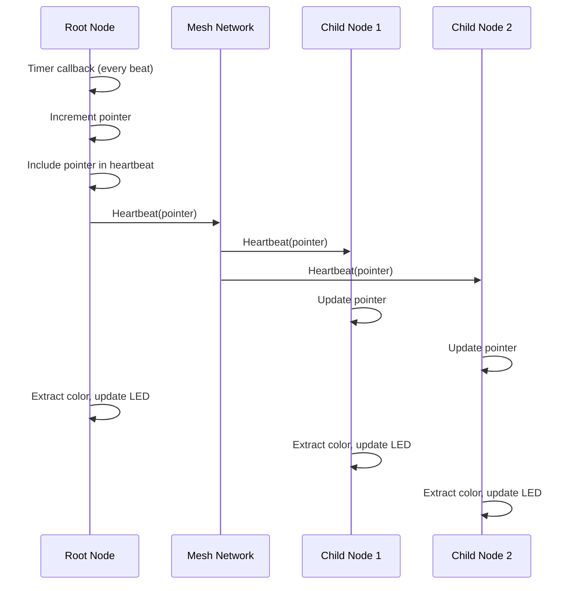

# Sequence Mode Developer Guide

**Last Updated:** 2025-12-30

## Table of Contents

1. [Overview](#overview)
2. [Architecture](#architecture)
3. [Data Formats](#data-formats)
4. [Algorithms](#algorithms)
5. [API Reference](#api-reference)
6. [Integration Points](#integration-points)
7. [State Management](#state-management)
8. [Synchronization](#synchronization)

## Overview

### Purpose

Sequence mode enables synchronized playback of color sequences across all nodes in an ESP-MESH network. The system allows users to create patterns using a 16x16 grid (up to 256 squares), set playback tempo, and synchronize sequences to all connected nodes with automatic drift correction.

> **For Users**: See [User Guide](../user-guides/mode-sequence.md) for usage instructions and examples.

### Design Decisions

**Variable-length sequences**: Sequences can be 1-16 rows (16-256 squares) to allow efficient use of memory and network bandwidth for shorter patterns.

**4-bit color quantization**: Colors are stored as 4-bit values (16 levels per channel) instead of 8-bit to reduce memory usage from 768 bytes to 384 bytes for a full 256-square sequence.

**Packed color format**: Two squares are packed into 3 bytes, reducing storage requirements by 50% compared to storing RGB values separately.

**Heartbeat synchronization**: Root node includes sequence pointer in heartbeat messages to correct timer drift while allowing nodes to play independently if heartbeat messages are lost.

**Plugin architecture**: Sequence functionality is implemented as a plugin (`sequence_plugin.c`) that handles both root and child node logic through the plugin system.

## Architecture

### File Structure

The sequence mode implementation consists of the following files:

- **`src/plugins/sequence/sequence_plugin.c`**: Plugin implementation
  - Handles both root and child node logic
  - Sequence storage and broadcasting
  - Playback timer management
  - Heartbeat synchronization integration
  - Plugin system integration

- **`src/plugins/sequence/sequence_plugin.h`**: Plugin API definitions
  - Function declarations for API handlers
  - Plugin registration function
  - Constants and data structures

### Module Responsibilities

**Plugin Implementation** (`sequence_plugin.c`):
- Handles both root and child node logic through plugin callbacks
- Receives sequence data via HTTP POST `/api/sequence` (root node)
- Stores sequence data locally
- Broadcasts sequence to all child nodes via mesh network (root node)
- Manages playback timer for both root and child nodes
- Integrates with heartbeat system for synchronization
- Provides pointer query endpoint (`GET /api/sequence/pointer`) (root node)
- Processes plugin commands (PLUGIN_CMD_DATA, PLUGIN_CMD_START, etc.)
- Handles heartbeat synchronization (child nodes)

**Plugin System Integration**:
- Plugin registered with plugin system during initialization
- Commands routed through plugin system
- Lifecycle managed by plugin system (activate/deactivate)
- Control commands (START/PAUSE/RESET) handled via plugin callbacks

**Shared Functionality**:
- Color extraction algorithm
- Size calculation helpers (via plugin helper callbacks)
- Data format definitions

## Data Formats

### Packed Color Array Format

Colors are stored in a packed format where **2 squares = 3 bytes**:

**Byte Layout**:
- **Byte 0**: Even square R (upper nibble), Even square G (lower nibble)
- **Byte 1**: Even square B (upper nibble), Odd square R (lower nibble)
- **Byte 2**: Odd square G (upper nibble), Odd square B (lower nibble)

**Example** (squares 0 and 1):
- Square 0: R=12 (0xC), G=5 (0x5), B=10 (0xA)
- Square 1: R=3 (0x3), G=15 (0xF), B=7 (0x7)

Packed as:
- Byte 0: `0xC5` (R=0xC in upper nibble, G=0x5 in lower nibble)
- Byte 1: `0xA3` (B=0xA in upper nibble, R=0x3 in lower nibble)
- Byte 2: `0xF7` (G=0xF in upper nibble, B=0x7 in lower nibble)

**Size Calculation**:
- Maximum size: 384 bytes (256 squares)
- Variable size: `num_rows * 24` bytes
- Formula: `(num_rows * 16 / 2) * 3 = num_rows * 24`

### Command Packet Formats

**SEQUENCE Command** (variable length):
```
Byte 0: MESH_CMD_SEQUENCE (0x04)
Byte 1: rhythm (1-255, in 10ms units)
Byte 2: num_rows (1-16, number of rows)
Bytes 3-N: color_data (variable length, num_rows * 24 bytes)
```

Total size: `3 + (num_rows * 24)` bytes

**START Command** (1 byte):
```
Byte 0: MESH_CMD_SEQUENCE_START (0x05)
```

**STOP Command** (1 byte):
```
Byte 0: MESH_CMD_SEQUENCE_STOP (0x06)
```

**RESET Command** (1 byte):
```
Byte 0: MESH_CMD_SEQUENCE_RESET (0x07)
```

**BEAT Command** (2 bytes):
```
Byte 0: MESH_CMD_SEQUENCE_BEAT (0x08)
Byte 1: pointer (0-255, current position)
```

### HTTP Payload Format

**POST /api/sequence** (variable length):
```
Byte 0: rhythm (1-255, in 10ms units)
Byte 1: num_rows (1-16, number of rows)
Bytes 2-N: color_data (variable length, num_rows * 24 bytes)
```

Total size: `2 + (num_rows * 24)` bytes

**GET /api/sequence/pointer**:
- Response: Plain text number (0-255)
- Example: `"42"` (pointer at position 42)

### Rhythm Value Encoding

Rhythm values are encoded in **10ms units**:

- **Frontend tempo (ms) → Backend rhythm**: `Math.floor(tempo / 10)`
- **Backend rhythm → Actual interval**: `rhythm * 10ms` (in microseconds: `rhythm * 10000`)

**Examples**:
- Tempo 250ms → Rhythm 25 → Interval 250ms
- Tempo 100ms → Rhythm 10 → Interval 100ms
- Tempo 2550ms → Rhythm 255 → Interval 2550ms

**Validation**:
- Minimum rhythm: 1 (10ms)
- Maximum rhythm: 255 (2550ms)
- Invalid: 0 (rejected)

### Variable-Length Handling

Size calculation functions (via plugin helper callbacks):

The plugin provides helper functions accessible via `plugin_get_helper()`:
- `SEQUENCE_HELPER_COLOR_DATA_SIZE`: Returns color data size for given number of rows
- `SEQUENCE_HELPER_PAYLOAD_SIZE`: Returns HTTP payload size
- `SEQUENCE_HELPER_MESH_CMD_SIZE`: Returns mesh command size

Formula: `(num_rows * 16 / 2) * 3 = num_rows * 24`

**Validation**:
- HTTP endpoint validates `num_rows` before calculating expected size
- Mesh command handler validates size matches expected value
- Both reject if `num_rows < 1 || num_rows > 16`

## Algorithms

### Color Extraction Algorithm

**Input**: Packed color array, square index (0-255)

**Output**: RGB values (4-bit, 0-15 each)

**Steps**:

1. **Validate inputs**: Check pointers are not NULL
2. **Validate square index**:
   - Child node: `square_index < (sequence_length * 16)` (correct)
   - Root node: `square_index >= 256` (hardcoded, should use `sequence_length * 16`)
3. **Calculate pair index**: `pair_index = square_index / 2`
4. **Calculate byte offset**: `byte_offset = pair_index * 3`
5. **Extract based on even/odd**:
   - **Even square** (`square_index % 2 == 0`):
     - R = `(packed_data[byte_offset] >> 4) & 0x0F`
     - G = `packed_data[byte_offset] & 0x0F`
     - B = `(packed_data[byte_offset + 1] >> 4) & 0x0F`
   - **Odd square** (`square_index % 2 == 1`):
     - R = `packed_data[byte_offset + 1] & 0x0F`
     - G = `(packed_data[byte_offset + 2] >> 4) & 0x0F`
     - B = `packed_data[byte_offset + 2] & 0x0F`

**Implementation**: See `extract_square_rgb()` in `sequence_plugin.c`

**Note**: The plugin implementation correctly uses `sequence_length * 16` for validation, supporting variable-length sequences.

### Color Scaling Algorithm

**Input**: 4-bit RGB values (0-15)

**Output**: 8-bit RGB values (0-255)

**Algorithm**: `8bit_value = 4bit_value * 16`

**Rationale**:
- 4-bit range: 0-15 (16 levels)
- 8-bit range: 0-255 (256 levels)
- Scaling factor: 255/15 = 17, but using 16 for simplicity
- Result: 0→0, 15→240 (not 255, but close enough for LED display)

**Implementation**: See timer callbacks in both modules:
```c
r_scaled = r_4bit * 16;
g_scaled = g_4bit * 16;
b_scaled = b_4bit * 16;
```

### Pointer Wrapping Logic

**Pointer Range**: 0 to `(sequence_length * 16) - 1`

**Increment and Wrap**:
```c
uint16_t max_squares = sequence_length * 16;
sequence_pointer = (sequence_pointer + 1) % max_squares;
```

**Examples**:
- 4 rows: max_squares = 64, pointer wraps at 64 (0-63)
- 16 rows: max_squares = 256, pointer wraps at 256 (0-255)

**Row Boundary Detection**:
```c
if ((sequence_pointer % 16) == 0 && sequence_pointer < max_squares) {
    // At row boundary, send BEAT
}
```

**Edge Cases**:
- Pointer 0: Start of sequence, row boundary
- Pointer at max_squares: Wraps to 0
- Pointer validation: Check `pointer < max_squares` before BEAT send

### Heartbeat Synchronization Algorithm

**When Pointer is Included in Heartbeat**:
- Root node timer callback increments pointer
- Pointer value included in heartbeat payload via `sequence_plugin_get_pointer_for_heartbeat()`
- Heartbeat sent periodically by mesh heartbeat system

**Heartbeat Message Processing (Child Node)**:

1. **Validate plugin is active**: Ignore if sequence plugin not active
2. **Validate pointer**: Check `received_pointer < max_squares`
3. **Update pointer**: `sequence_pointer = received_pointer`
4. **Continue playback**: Timer continues without reset (heartbeat provides pointer sync)

**Drift Correction**:
- **Why drift occurs**: Timer inaccuracies accumulate over time
- **How heartbeat corrects**: Pointer update synchronizes all nodes
- **Frequency**: Based on heartbeat interval (typically more frequent than BEAT)
- **Effect**: Prevents long-term drift while allowing smooth playback

**Independent Playback**:
- Child nodes continue playing if heartbeat messages are lost
- Timer runs independently with local rhythm value
- Resynchronization occurs on next received heartbeat message
- No error if heartbeat is lost (graceful degradation)

## API Reference

### Root Node Functions (for API handlers)

#### `sequence_plugin_root_store_and_broadcast()`

**Signature**:
```c
esp_err_t sequence_plugin_root_store_and_broadcast(uint8_t rhythm, uint8_t num_rows,
                                                    uint8_t *color_data, uint16_t color_data_len);
```

**Parameters**:
- `rhythm`: Rhythm value in 10ms units (1-255)
- `num_rows`: Number of rows in sequence (1-16)
- `color_data`: Pointer to packed color array
- `color_data_len`: Length of color_data in bytes

**Returns**: `ESP_OK` on success, error code on failure

**Behavior**:
- Validates inputs (rhythm, num_rows, color_data pointer)
- Stores sequence data locally
- Stops existing timer if running
- Resets pointer to 0
- Starts root node playback timer
- Broadcasts sequence to all child nodes via mesh network using plugin system
- Returns success even if no child nodes exist

**Error Codes**:
- `ESP_ERR_INVALID_STATE`: Not root node
- `ESP_ERR_INVALID_ARG`: Invalid rhythm (0), num_rows (<1 or >16), or NULL color_data
- `ESP_ERR_INVALID_SIZE`: Color data length exceeds maximum

#### `sequence_plugin_root_start()`

**Signature**:
```c
esp_err_t sequence_plugin_root_start(void);
```

**Returns**: `ESP_OK` on success, error code on failure

**Behavior**:
- Stops existing timer if running
- Validates and preserves pointer (resets if out of bounds)
- Starts playback timer
- Plugin system automatically broadcasts START command to all child nodes

**Error Codes**:
- `ESP_ERR_INVALID_STATE`: Not root node or no sequence data
- Timer creation/start errors

#### `sequence_plugin_root_pause()`

**Signature**:
```c
esp_err_t sequence_plugin_root_pause(void);
```

**Returns**: `ESP_OK` on success

**Behavior**:
- Stops and deletes playback timer
- Plugin system automatically broadcasts PAUSE command to all child nodes

**Error Codes**:
- `ESP_ERR_INVALID_STATE`: Not root node

#### `sequence_plugin_root_reset()`

**Signature**:
```c
esp_err_t sequence_plugin_root_reset(void);
```

**Returns**: `ESP_OK` on success, error code on failure

**Behavior**:
- Resets pointer to 0
- If sequence is active, restarts timer from beginning
- Plugin system automatically broadcasts RESET command to all child nodes

**Error Codes**:
- `ESP_ERR_INVALID_STATE`: Not root node

#### `sequence_plugin_root_get_pointer()`

**Signature**:
```c
uint16_t sequence_plugin_root_get_pointer(void);
```

**Returns**: Current sequence pointer value (0-255)

**Behavior**:
- Returns current pointer position
- Used by HTTP endpoint for web UI indicator

#### `sequence_plugin_root_is_active()`

**Signature**:
```c
bool sequence_plugin_root_is_active(void);
```

**Returns**: `true` if sequence is active, `false` otherwise

**Behavior**:
- Returns current playback state
- Used to check if heartbeat should be disabled

#### `sequence_plugin_get_pointer_for_heartbeat()`

**Signature**:
```c
uint8_t sequence_plugin_get_pointer_for_heartbeat(void);
```

**Returns**: Sequence pointer (0-255) if plugin is active, 0 otherwise

**Behavior**:
- Returns current sequence pointer as 1-byte value if plugin is active
- Returns 0 if plugin is inactive
- Used by heartbeat timer to include sequence pointer in heartbeat payload

### Child Node Functions

#### `sequence_plugin_handle_heartbeat()`

**Signature**:
```c
esp_err_t sequence_plugin_handle_heartbeat(uint8_t pointer, uint8_t counter);
```

**Parameters**:
- `pointer`: Sequence pointer from heartbeat (0-255)
- `counter`: Synchronization counter from heartbeat (0-255)

**Returns**: `ESP_OK` on success, error code on failure

**Behavior**:
- Validates plugin is active (ignores if not active)
- Validates pointer is within range
- Updates local pointer to received value
- Continues playback without timer reset (heartbeat provides pointer sync)

**Error Codes**:
- `ESP_ERR_INVALID_STATE`: Root node (should not be called) or no sequence data
- `ESP_ERR_INVALID_ARG`: Invalid pointer value

#### `sequence_plugin_node_pause()`

**Signature**:
```c
void sequence_plugin_node_pause(void);
```

**Behavior**:
- Stops and deletes playback timer
- Available for manual pausing but not automatically called
- Note: RGB commands are now handled through plugin system and don't automatically pause plugins

### Plugin Callbacks

The sequence plugin implements the following plugin system callbacks:

- **`command_handler`**: Handles `PLUGIN_CMD_DATA` commands (sequence data storage)
- **`on_start`**: Handles START command (root and child node logic)
- **`on_pause`**: Handles PAUSE command (root and child node logic)
- **`on_reset`**: Handles RESET command (root and child node logic)
- **`on_stop`**: Handles STOP command
- **`is_active`**: Returns current playback state
- **`get_state`**: Returns sequence state (pointer, rhythm, length, active status)
- **`execute_operation`**: Executes operations (STORE, START, PAUSE, RESET)
- **`get_helper`**: Returns helper values (payload size, mesh cmd size, color data size)

## Integration Points

### HTTP Endpoint Integration

**File**: `src/mesh_web.c`

**POST /api/sequence** (`api_sequence_post_handler`):

1. **Reads payload** in two stages:
   - First 2 bytes: rhythm + num_rows
   - Remaining bytes: color_data (variable length)

2. **Validates**:
   - `num_rows` in range 1-16
   - `rhythm` in range 1-255
   - Payload size matches expected size
   - Color data length matches expected size

3. **Calls**: `sequence_plugin_root_store_and_broadcast(rhythm, num_rows, color_data, color_data_len)`

4. **Returns**: JSON response `{"success": true}` or error message

**GET /api/sequence/pointer** (`api_sequence_pointer_handler`):

1. **Calls**: `sequence_plugin_root_get_pointer()`
2. **Returns**: Plain text pointer value (0-255)
3. **Used by**: Web UI current square indicator

**Registration**: Endpoints registered in `mesh_web_start()` function

**Web UI Current Square Indicator**:

The web UI includes a visual indicator that shows which square is currently playing:

- **Function**: `updateSequenceIndicator()` - Fetches pointer from backend and updates border
- **Function**: `startSequenceIndicator()` - Starts periodic updates every `tempo * 16` ms
- **Function**: `stopSequenceIndicator()` - Stops updates and removes border
- **Update interval**: `tempo * 16` milliseconds (once per row)
- **Implementation**: Uses `setInterval()` to periodically call `updateSequenceIndicator()`
- **Border class**: `.grid-square.current` CSS class applied to current square
- **Pointer calculation**: `row = Math.floor(pointer / 16)`, `col = pointer % 16`

**Web UI CSV Import/Export**:

The web UI provides CSV import/export functionality:

- **Export function**: `exportGridToCSV()` - Generates CSV from current grid data
- **Import function**: `importSequence()` - Parses CSV and populates grid
- **CSV format**: `index;RED;GREEN;BLUE` (one line per square)
- **Index range**: 1-256 (1-based, where 1 = row 0, col 0)
- **Color values**: 4-bit (0-15) per channel
- **Row count detection**: Automatically calculates from maximum index in CSV using `Math.ceil(maxIndex / 16)`
- **Functions**:
  - `parseCSVLine()` - Parses single CSV line, validates format and values
  - `parseCSVText()` - Parses entire CSV text, handles line breaks
  - `populateGridFromCSV()` - Populates grid and returns calculated row count
  - `packGridData()` - Packs grid data for transmission (2 squares = 3 bytes)

**Web UI Dynamic Grid Sizing**:

The web UI dynamically resizes the grid based on selected row count:

- **Function**: `updateGridRows()` - Updates grid display based on `numRows`
- **CSS update**: Sets `gridTemplateRows` to `'auto repeat(' + numRows + ', 1fr)'`
- **Square visibility**: Hides squares beyond `numRows` using `display: none`
- **Row label visibility**: Row labels are hidden along with their squares
- **Automatic resizing**: Grid container only takes space for visible rows

### Mesh Command Integration

**File**: `src/mesh_child.c`

**Command Reception** (`esp_mesh_p2p_rx_main`):

1. **Detects plugin command**: Command routed through plugin system
2. **Plugin system routes**: Calls plugin's `command_handler` callback
3. **Sequence plugin handles**: Processes `PLUGIN_CMD_DATA` commands

**Control Command Handling**:

1. **Detects plugin control commands**: START/PAUSE/RESET routed through plugin system
2. **Plugin system routes**: Calls plugin's `on_start`, `on_pause`, or `on_reset` callbacks
3. **Sequence plugin handles**: Processes control commands for root and child nodes

**RGB Command Interaction**:

- RGB commands are handled through the plugin system
- When a plugin is active, RGB commands are ignored (plugins control LEDs exclusively)
- Sequence mode takes priority during playback (heartbeat disabled)

**File**: `src/mesh_root.c`

**Broadcasting Pattern**:

- Uses routing table from `esp_mesh_get_routing_table()`
- Iterates through all nodes in routing table
- Sends P2P messages using `esp_mesh_send()`
- Logs success/failure counts

### LED Control Integration

**File**: `src/light_neopixel.c` (via `light_neopixel.h`)

**Function**: `mesh_light_set_rgb(uint8_t r, uint8_t g, uint8_t b)`

**Usage**:
- Called from timer callbacks in both root and node modules
- RGB values are scaled from 4-bit to 8-bit before calling
- Updates LED hardware (WS2812 or RGB LED)

**Color Scaling**:
- Sequence mode: 4-bit values (0-15) scaled to 8-bit (0-240)
- RGB mode: Direct 8-bit values (0-255)
- Both modes use same LED update function

### Heartbeat Interaction

**File**: `src/mesh_child.c`

**Heartbeat Handler**:

- Checks if sequence plugin is active before processing heartbeat
- If sequence active: Skips LED changes (sequence controls LED)
- If sequence not active: Normal heartbeat behavior (even/odd toggle)
- Heartbeat includes sequence pointer if plugin is active

**File**: `src/mesh_root.c`

**Root Node Heartbeat**:

- Heartbeat behavior unchanged during sequence mode
- Root node continues to blink white on heartbeat
- Only child nodes disable heartbeat LED changes

## State Management

### State Variables

**Plugin Implementation** (`sequence_plugin.c`):
- `sequence_rhythm`: Rhythm value in 10ms units (default: 25 = 250ms)
- `sequence_colors[]`: Packed color data array (384 bytes max)
- `sequence_length`: Number of rows (1-16, default: 16)
- `sequence_pointer`: Current position (0-255)
- `sequence_timer`: ESP timer handle (NULL when stopped)
- `sequence_active`: Playback state (true when playing)
- `sequence_plugin_id`: Plugin ID assigned during registration

### State Machine

**States**:

1. **Inactive** (no sequence data):
   - `sequence_rhythm == 0` (child node) or default (root node)
   - `sequence_active == false`
   - `sequence_timer == NULL`

2. **Active** (sequence playing):
   - `sequence_rhythm != 0`
   - `sequence_active == true`
   - `sequence_timer != NULL`

**State Transitions**:

1. **Store → Active**:
   - `sequence_plugin_root_store_and_broadcast()` or plugin `command_handler` callback
   - Stores data, starts timer, sets `sequence_active = true`

2. **Active → Inactive**:
   - `sequence_plugin_root_pause()` or plugin `on_pause`/`on_stop` callbacks
   - Stops timer, deletes timer, sets `sequence_active = false`

3. **Active → Active** (reset):
   - `sequence_plugin_root_reset()` or plugin `on_reset` callback
   - Resets pointer, restarts timer if active

4. **Active → Active** (heartbeat sync):
   - `sequence_plugin_handle_heartbeat()`
   - Updates pointer, continues playback

### Timer Lifecycle

**Creation**:
- Triggered by: `sequence_timer_start(rhythm)`
- Creates ESP timer with periodic callback
- Sets `sequence_active = true`
- Timer interval: `rhythm * 10000` microseconds

**Deletion**:
- Triggered by: `sequence_timer_stop()`
- Stops timer (handles `ESP_ERR_INVALID_STATE` gracefully)
- Deletes timer
- Sets `sequence_timer = NULL`
- Sets `sequence_active = false`

**Reset** (child node only):
- Triggered by: RESET command via plugin `on_reset` callback
- Stops and deletes current timer
- Creates new timer with same rhythm
- Resets timer phase to synchronize

**Callback**:
- Called periodically by ESP timer
- Validates plugin is active before processing
- Extracts color for current square
- Scales to 8-bit
- Updates LED
- Increments and wraps pointer
- Pointer included in heartbeat payload (root node only)

### Pointer Management

**Initialization**:
- Set to 0 when sequence is stored
- Set to 0 on START or RESET commands

**Increment**:
- Incremented in timer callback: `sequence_pointer = (sequence_pointer + 1) % max_squares`
- Wraps at sequence length boundary

**Heartbeat Updates**:
- Child node: Pointer set directly to received value from heartbeat
- Root node: Pointer included in heartbeat payload

**Validation**:
- Checked against `max_squares = sequence_length * 16`
- Validated before heartbeat send and heartbeat receive

## Synchronization

### Heartbeat Synchronization Mechanism

**When Pointer is Included in Heartbeat**:

Root node timer callback (`sequence_timer_cb` in `sequence_plugin.c`):

1. **Pointer increment**: Pointer incremented in timer callback
2. **Pointer inclusion**: `sequence_plugin_get_pointer_for_heartbeat()` returns current pointer
3. **Heartbeat generation**: Mesh heartbeat system includes pointer in heartbeat payload
4. **Frequency**: Based on heartbeat interval (typically more frequent than row boundaries)

**Heartbeat Message Format**:
- Command: `MESH_CMD_HEARTBEAT`
- Payload includes: Sequence pointer (1 byte, 0-255) if plugin is active
- Total size: Variable (includes other heartbeat data)

**Heartbeat Broadcasting**:
- Handled by mesh heartbeat system
- Automatically sent to all child nodes
- Includes sequence pointer if plugin is active

**Heartbeat Reception** (child node):

1. **Validation**: Checks plugin is active (ignores if not active)
2. **Pointer validation**: Checks `received_pointer < max_squares`
3. **Pointer update**: `sequence_pointer = received_pointer`
4. **Continue playback**: Timer continues without reset (heartbeat provides pointer sync)

### Drift Correction

**Why Drift Occurs**:

- Timer inaccuracies accumulate over time
- Different nodes may have slightly different timer frequencies
- Network delays can cause desynchronization
- Without correction, nodes would drift apart over time

**How Heartbeat Corrects Drift**:

1. **Pointer update**: All nodes set pointer to root's current position
2. **Continue playback**: Nodes continue playing without timer reset
3. **Resynchronization**: All nodes use same pointer value
4. **Frequency**: Correction happens on each heartbeat (more frequent than row boundaries)

**Effectiveness**:

- Prevents long-term drift accumulation
- Maintains synchronization within acceptable tolerance
- Allows smooth playback between corrections

### Heartbeat Integration

**Pointer Inclusion Logic**:
```c
uint8_t sequence_plugin_get_pointer_for_heartbeat(void) {
    if (plugin_is_active("sequence") && sequence_active) {
        return (uint8_t)(sequence_pointer & 0xFF);
    }
    return 0;
}
```

**Conditions**:
- Plugin must be active
- Sequence must be active
- Returns pointer value (0-255) or 0 if inactive

**Edge Cases**:
- Pointer 0: Valid start position
- Pointer at max_squares: Wraps to 0
- Short sequences: Pointer still included in heartbeat

### Independent Playback

**Behavior When Heartbeat Lost**:

- Child nodes continue playing independently
- Timer continues running with local rhythm value
- Pointer increments locally
- No error or warning if heartbeat is lost

**Resynchronization**:

- Next received heartbeat message resynchronizes the node
- Pointer jumps to received value
- Playback continues from synchronized position
- No timer reset needed (heartbeat provides pointer sync only)

**Benefits**:

- Graceful degradation if network has issues
- No interruption of playback
- Automatic recovery when heartbeat messages resume
- Better user experience than stopping playback
- More frequent synchronization than BEAT-based approach

### Synchronization Flow Diagram



## Data Flow Diagram

```mermaid
flowchart TD
    User[User] -->|HTTP POST| WebUI[Web UI]
    WebUI -->|Pack data| Pack[packGridData]
    Pack -->|POST /api/sequence| HTTP[HTTP Endpoint]
    HTTP -->|Validate| Validate[Validate Payload]
    Validate -->|Store & Broadcast| Root[Root Node]
    Root -->|Mesh Command| Mesh[Mesh Network]
    Mesh -->|SEQUENCE Command| Child1[Child Node 1]
    Mesh -->|SEQUENCE Command| Child2[Child Node 2]
    Root -->|Timer| RootTimer[Root Timer]
    RootTimer -->|Every Beat| RootLED[Root LED Update]
    RootTimer -->|Pointer| Heartbeat[Heartbeat System]
    Heartbeat -->|Heartbeat(pointer)| Mesh
    Mesh -->|Heartbeat| Child1
    Mesh -->|Heartbeat| Child2
    Child1 -->|Timer| Child1Timer[Child Timer]
    Child1Timer -->|Every Beat| Child1LED[Child LED Update]
    Child2 -->|Timer| Child2Timer[Child Timer]
    Child2Timer -->|Every Beat| Child2LED[Child LED Update]
    WebUI -->|GET /api/pointer| HTTP
    HTTP -->|Get Pointer| Root
    Root -->|Return Pointer| WebUI
    WebUI -->|Update Indicator| Indicator[Current Square Indicator]
```

## Cross-References

- **User Guide**: See [docs/user-guides/mode-sequence.md](../user-guides/mode-sequence.md) for user-facing documentation
- **Main README**: See [README.md](../../README.md) for project overview
- **Project Outline**: See [PROJECT_OUTLINE.md](../../PROJECT_OUTLINE.md) for project structure
