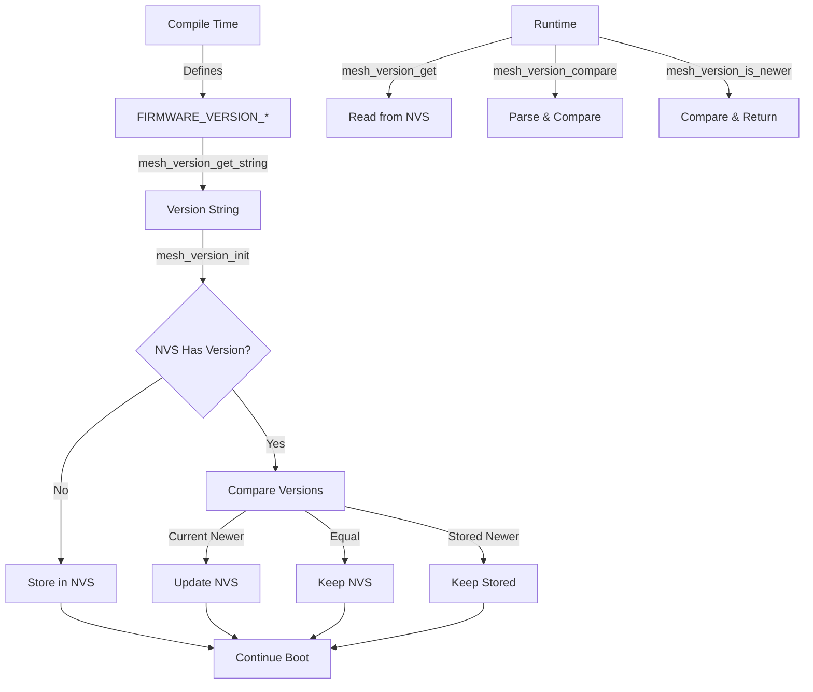

# OTA Foundation: Partition Table & Version Management

**Last Updated:** 2026-01-01

## Table of Contents

1. [Overview](#overview)
2. [Partition Table Configuration](#partition-table-configuration)
3. [Version Management System](#version-management-system)
4. [API Reference](#api-reference)
5. [Integration Points](#integration-points)
6. [Data Flow](#data-flow)
7. [NVS Storage](#nvs-storage)
8. [Testing](#testing)

## Overview

### Purpose

The OTA foundation provides the infrastructure necessary for Over-The-Air firmware updates. This includes:

- Dual OTA partition support (app0 and app1) for safe firmware updates
- Version management system for tracking firmware versions
- Version comparison to prevent downgrades
- Integration with boot process for automatic version initialization

> **For Users**: See [User Guide](../user-guides/ota-updates.md) for usage instructions.

### Design Decisions

**Dual OTA partitions**: The device uses two application partitions (app0 and app1) to ensure there's always a working firmware image. New firmware is written to the inactive partition, and the device switches to it only after successful verification.

**Version management in NVS**: Firmware versions are stored in NVS (Non-Volatile Storage) to persist across reboots and enable version tracking and comparison.

**Numerical version comparison**: Version strings are compared numerically, not lexicographically. This ensures that "1.0.9" < "1.1.0" (not "1.0.9" > "1.1.0").

**Module separation**: Version management is implemented as a separate module (`mesh_version.c`/`mesh_version.h`) to keep it independent from OTA update logic, allowing it to be used by other parts of the system.

## Partition Table Configuration

### Current Partition Layout

The partition table in [`huge_app.csv`](huge_app.csv) is configured as follows:

```csv
# Name,   Type, SubType, Offset,   Size,     Flags
nvs,      data, nvs,     0x9000,   0x5000,
otadata,  data, ota,     0xE000,   0x2000,
app0,     app,  ota_0,   0x10000,  0x190000,
app1,     app,  ota_1,   ,         0x190000,
spiffs,   data, spiffs,  ,         0x0D0000,
```

### Partition Descriptions

- **nvs**: Non-Volatile Storage partition (20KB) - Stores key-value pairs including firmware version
- **otadata**: OTA data partition (8KB) - Tracks which OTA partition (app0 or app1) to boot from
- **app0**: Primary OTA partition (1.6MB) - Contains the primary firmware image
- **app1**: Secondary OTA partition (1.6MB) - Contains the secondary firmware image for updates
- **spiffs**: SPIFFS filesystem partition (832KB) - Reduced from original size to accommodate app1

### Partition Size Calculations

- **Total flash required**: ~4.5MB (for 1.6MB firmware binary)
- **app0 and app1**: Each 0x190000 (1.6MB) - Must be large enough for firmware binary
- **SPIFFS reduction**: Reduced from 0x260000 (2.5MB) to 0x0D0000 (832KB) to make room for app1
- **Offset calculation**: app1 offset is left empty (auto-calculated by ESP-IDF build system)

### Flash Requirements

For a firmware binary of size `B`:
- Minimum flash size: `4 * B` (for dual OTA partitions)
- Recommended flash size: `4.5 * B` (includes NVS, otadata, and SPIFFS overhead)

Example: For a 1.5MB binary, you need at least 6MB flash, but 8MB is recommended.

## Version Management System

### Architecture

The version management system consists of:

- **Compile-time version**: Defined in [`include/mesh_version.h`](include/mesh_version.h) as `FIRMWARE_VERSION_MAJOR`, `FIRMWARE_VERSION_MINOR`, `FIRMWARE_VERSION_PATCH`
- **Runtime version storage**: Stored in NVS namespace "mesh" with key "fw_version"
- **Version API**: Functions for retrieving, storing, and comparing versions

### Version Format

Versions follow semantic versioning format: `MAJOR.MINOR.PATCH`

- **MAJOR**: Major version number (incompatible API changes)
- **MINOR**: Minor version number (backwards-compatible functionality)
- **PATCH**: Patch version number (backwards-compatible bug fixes)

Example: `1.2.3` means major version 1, minor version 2, patch version 3.

### Version Comparison Algorithm

Version comparison is performed numerically (not lexicographically):

1. Parse version strings into major, minor, and patch components
2. Compare major versions first
3. If equal, compare minor versions
4. If equal, compare patch versions
5. Return: negative if v1 < v2, zero if v1 == v2, positive if v1 > v2

This ensures that `1.0.9` < `1.1.0` (not `1.0.9` > `1.1.0`).

## API Reference

### `mesh_version_init()`

Initialize version management system.

```c
esp_err_t mesh_version_init(void);
```

**Description**: Called once during system initialization (after NVS is initialized). Checks if version exists in NVS, and if not, stores current version. If version exists, compares it with current version and updates if current is newer.

**Returns**: `ESP_OK` on success, error code on failure

**Example**:
```c
esp_err_t err = mesh_version_init();
if (err != ESP_OK) {
    ESP_LOGE("main", "Version init failed: %s", esp_err_to_name(err));
}
```

### `mesh_version_get()`

Get current firmware version string from NVS.

```c
esp_err_t mesh_version_get(char *version_str, size_t len);
```

**Parameters**:
- `version_str`: Buffer to store version string (must be at least 16 bytes)
- `len`: Size of version_str buffer

**Returns**:
- `ESP_OK` on success
- `ESP_ERR_NOT_FOUND` if version not in NVS
- `ESP_ERR_INVALID_ARG` if buffer is too small
- Other error codes on failure

**Example**:
```c
char version[16];
esp_err_t err = mesh_version_get(version, sizeof(version));
if (err == ESP_OK) {
    ESP_LOGI("main", "Current version: %s", version);
}
```

### `mesh_version_store()`

Store firmware version string in NVS.

```c
esp_err_t mesh_version_store(const char *version_str);
```

**Parameters**:
- `version_str`: Version string to store (format: "MAJOR.MINOR.PATCH")

**Returns**:
- `ESP_OK` on success
- `ESP_ERR_INVALID_ARG` if version format is invalid
- Other error codes on failure

**Example**:
```c
esp_err_t err = mesh_version_store("1.0.0");
if (err != ESP_OK) {
    ESP_LOGE("main", "Failed to store version: %s", esp_err_to_name(err));
}
```

### `mesh_version_compare()`

Compare two version strings.

```c
esp_err_t mesh_version_compare(const char *v1, const char *v2, int *result);
```

**Parameters**:
- `v1`: First version string (format: "MAJOR.MINOR.PATCH")
- `v2`: Second version string (format: "MAJOR.MINOR.PATCH")
- `result`: Pointer to store comparison result:
  - negative if v1 < v2
  - zero if v1 == v2
  - positive if v1 > v2

**Returns**:
- `ESP_OK` on success
- `ESP_ERR_INVALID_ARG` if version format is invalid

**Example**:
```c
int result;
esp_err_t err = mesh_version_compare("1.0.1", "1.0.0", &result);
if (err == ESP_OK) {
    if (result > 0) {
        ESP_LOGI("main", "1.0.1 is newer than 1.0.0");
    }
}
```

### `mesh_version_is_newer()`

Check if a version is newer than the current version.

```c
bool mesh_version_is_newer(const char *new_version, const char *current_version);
```

**Parameters**:
- `new_version`: Version string to check (format: "MAJOR.MINOR.PATCH")
- `current_version`: Current version string (format: "MAJOR.MINOR.PATCH")

**Returns**: `true` if new_version > current_version, `false` otherwise (including if versions are equal or on error)

**Example**:
```c
if (mesh_version_is_newer("1.1.0", "1.0.0")) {
    ESP_LOGI("main", "Update available: 1.1.0");
}
```

### `mesh_version_get_string()`

Get current firmware version as string from compile-time defines.

```c
const char* mesh_version_get_string(void);
```

**Returns**: Version string in format "MAJOR.MINOR.PATCH" (e.g., "1.0.0"). The returned string is static and should not be freed.

**Example**:
```c
const char *version = mesh_version_get_string();
ESP_LOGI("main", "Firmware version: %s", version);
```

## Integration Points

### Boot Process Integration

Version initialization is integrated into the boot process in [`src/mesh.c`](src/mesh.c):

```c
/* Initialize common mesh functionality (includes NVS initialization) */
ESP_ERROR_CHECK(mesh_common_init());

/* Initialize version management (after NVS is initialized) */
esp_err_t version_err = mesh_version_init();
if (version_err != ESP_OK) {
    ESP_LOGW("mesh_main", "[STARTUP] Version management initialization failed: %s",
             esp_err_to_name(version_err));
} else {
    const char *version = mesh_version_get_string();
    ESP_LOGI("mesh_main", "[STARTUP] Firmware version: %s", version);
}
```

**Initialization Order**:
1. GPIO initialization
2. LED strip initialization
3. Mesh common initialization (includes NVS initialization)
4. **Version management initialization** (after NVS is ready)
5. Root node initialization
6. Child node initialization

### NVS Initialization Dependency

Version management requires NVS to be initialized first. NVS initialization happens in [`src/mesh_common.c`](src/mesh_common.c) via `nvs_flash_init()`, which is called during `mesh_common_init()`.

### Future Integration Points

The version management system will be used by:

- **OTA download module**: To check if downloaded firmware is newer than current
- **OTA distribution module**: To verify version before distributing to nodes
- **Rollback mechanism**: To track version changes and enable rollback
- **Web UI**: To display current firmware version to users

## Data Flow

The version data flows through the system as follows:



## NVS Storage

### Namespace and Key

- **Namespace**: `"mesh"` (consistent with existing codebase)
- **Key**: `"fw_version"`
- **Value Type**: String (format: "MAJOR.MINOR.PATCH")

### Storage Location

Version is stored in the NVS partition, which is persistent across reboots and firmware updates (unless NVS partition is erased).

### Access Pattern

- **Write**: During `mesh_version_init()` if version doesn't exist or current version is newer
- **Read**: During `mesh_version_init()` for comparison, and via `mesh_version_get()` for runtime access
- **Update**: Automatically updated during `mesh_version_init()` if current version is newer than stored

## Testing

### Unit Testing

Test version management functions with various inputs:

1. **Version initialization**: Test first boot (no version in NVS) and subsequent boots (version exists)
2. **Version retrieval**: Test with valid and invalid buffers, test when version doesn't exist
3. **Version comparison**: Test with various version pairs:
   - `1.0.0` vs `1.0.1` (should return negative)
   - `1.0.1` vs `1.0.0` (should return positive)
   - `1.0.0` vs `1.0.0` (should return zero)
   - `1.0.9` vs `1.1.0` (should return negative)
   - `1.9.9` vs `2.0.0` (should return negative)
4. **Version validation**: Test with invalid version strings (should return error)
5. **Edge cases**: Test with leading zeros, very large numbers, etc.

### Integration Testing

1. **Boot sequence**: Verify version initialization happens correctly during boot
2. **NVS persistence**: Verify version persists across reboots
3. **Version update**: Simulate version change and verify NVS is updated
4. **Error handling**: Test behavior when NVS is not initialized or unavailable

### Partition Table Testing

1. **Compilation**: Verify partition table compiles without errors
2. **Boot**: Verify device boots successfully with new partition table
3. **Partition detection**: Use `esp_ota_get_running_partition()` and `esp_ota_get_next_update_partition()` to verify partitions are detected
4. **Functionality**: Verify existing functionality still works with reduced SPIFFS partition

---

> **For Users**: See [User Guide](../user-guides/ota-updates.md) for usage instructions and troubleshooting.
